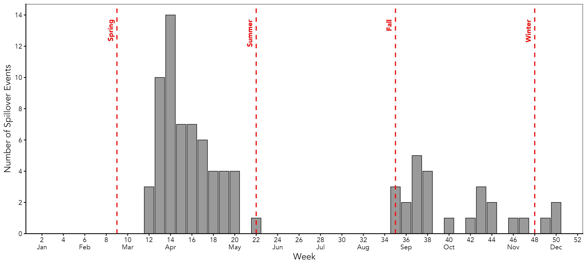
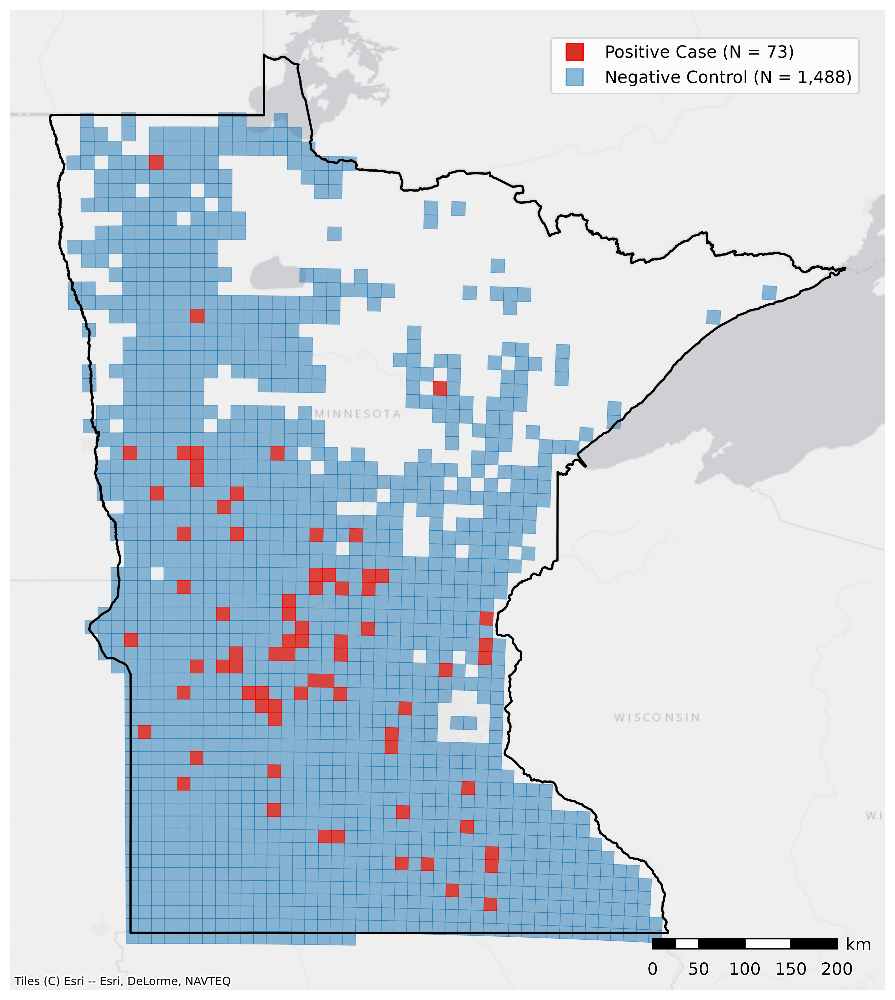
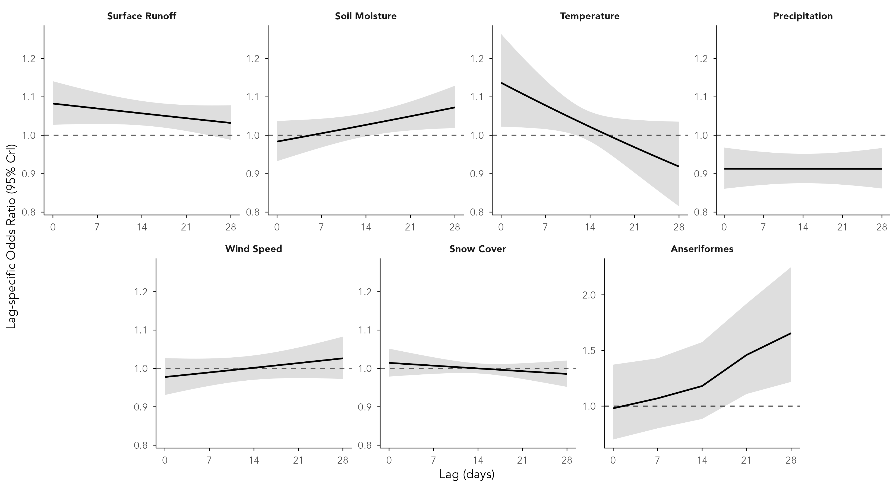
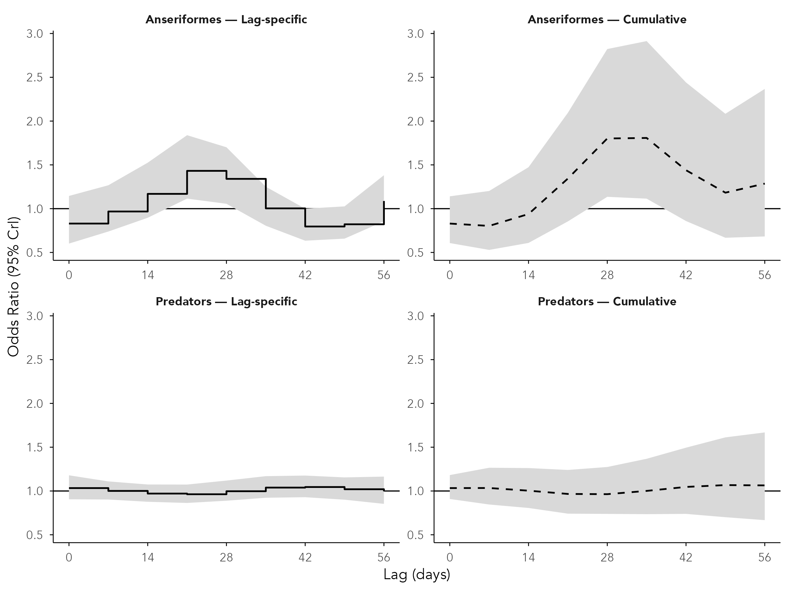
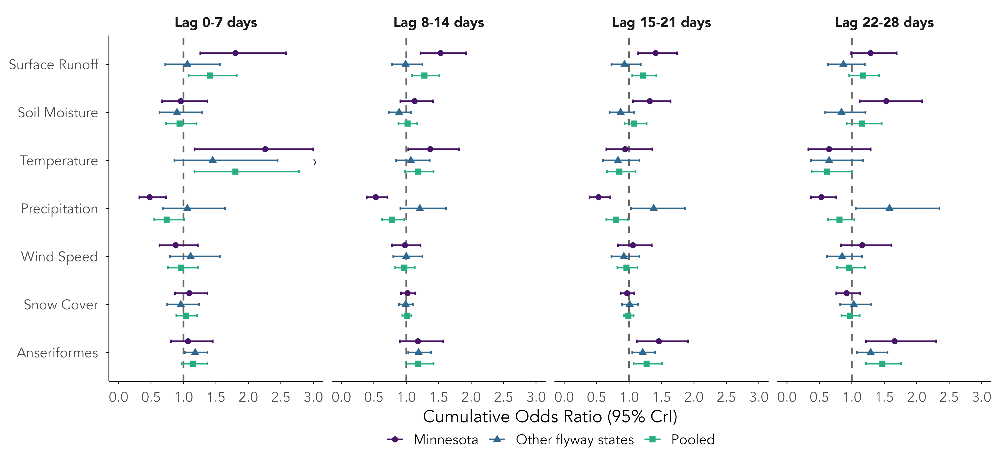
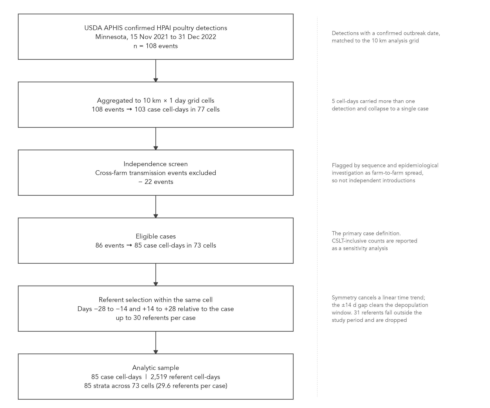
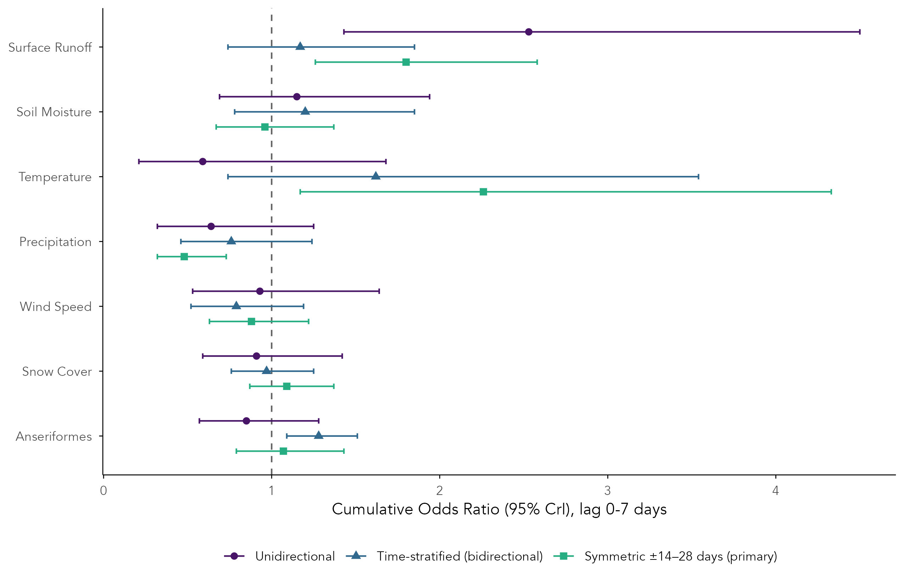

```{r setup}
project.folder <- paste0(here::here(), "/")
source(paste0(project.folder, "create_folder_structure.R"))
suppressMessages({library(data.table); library(knitr)})
obj <- function(f) {
  p <- paste0(objects_folder, f)
  if (file.exists(p)) setDT(readRDS(p)) else NULL
}
lst <- function(f) {
  p <- paste0(objects_folder, f)
  if (file.exists(p)) readRDS(p) else NULL
}
show <- function(x, ...) if (is.null(x)) cat("_not yet built_\n") else kable(x, ...)
T1 <- lst("table1_parts.RDS"); T2 <- lst("table2_parts.RDS")

# Typst sandboxes to this directory and refuses to read ../05_figures, so stage local copies.
# Cheap, and it keeps the HTML and PDF referencing exactly the same images.
dir.create("figures", showWarnings = FALSE)
for (f in c(file.path(figures_main_folder,
                      c("figure1_epidemic_curve.png", "figure2_case_zone_map.png",
                        "figure3_lag_response.png", "figure4_birds_lag_response.png",
                        "figure5_flyway_forest.png", "figure_consort_flowchart.png")),
            file.path(figures_sensitivity_folder, "figureS_referent_design.png")))
  if (file.exists(f)) file.copy(f, file.path("figures", basename(f)), overwrite = TRUE)
```

Every exhibit for the GeoHealth revision, with the caption to use and what the result shows.
Tables are rendered inline from the saved model objects, so this document and the `.docx` files
cannot drift apart.

## The model

Bayesian case-crossover distributed lag model fitted in INLA as a conditional Poisson with a
free intercept per stratum, which reproduces conditional logistic regression to two decimal
places. The unit of analysis is a **cell-day**: for each of 85 spillover events the case is that
10 km cell on the confirmed outbreak date, and the referents are **the same cell** on days −28 to
−14 and +14 to +28. Because each cell serves as its own control, all time-invariant
characteristics — feedlot density, land cover, terrain, biosecurity — are conditioned out, and
only day-to-day variation can explain why an outbreak occurred on one day rather than another.

Exposures enter over a **0–28 day lag window** on a natural cubic spline lag basis with two
degrees of freedom and `N(0, 0.25²)` priors. Meteorological exposures are linear on the exposure
scale, except temperature, which is modelled as a linear threshold at 10 °C. Waterfowl abundance
is weekly and enters as a first-order random-walk smooth across weekly lag knots. Effect
estimates are per +0.5 SD, except temperature, which is per +5 °C above the threshold. Surface
runoff and precipitation are converted from metres to millimetres, log-transformed, then
standardised.

Two windows are distinct and easily conflated:

| | what it determines | value |
|---|---|---|
| **Referent window** | which days serve as controls | ±14 to ±28 days, both sides |
| **Lag window** | how far back exposure is measured for each day | 0–28 days |

Panels are built by [`a_06_build_symmetric_panels.R`](../02_code/2a_data_prep/a_06_build_symmetric_panels.R),
which stores 56 lag columns so the 42- and 56-day sensitivity analyses can be fitted without
rebuilding. Every model fits 28 days.



# Main text — figures

### Figure 1



- **Caption.** Weekly distribution of confirmed highly pathogenic avian influenza spillover
  events in Minnesota commercial and backyard poultry premises, 2022 (n = 85). Dashed lines
  indicate meteorological season boundaries.
- **Shows.** A bimodal epidemic with a spring wave peaking in week 14 (60 events, 71%) and a
  smaller autumn wave beginning in week 35 (21 events, 25%), separated by a summer period with
  a single event. The two waves coincide with spring and autumn waterfowl migration.

### Figure 2



- **Caption.** 10 km study cells in Minnesota. Cells shaded red contained at least one confirmed
  spillover event in 2022 (N = 73); cells shaded blue contained a registered farm or feedlot but
  no confirmed spillover event (N = 1,488).
- **Shows.** Spillover events concentrate in central and south-central Minnesota, within the
  state's principal turkey-producing region. The at-risk population of feedlot cells spans the
  same agricultural areas at roughly twenty times the number of cells, so the spatial
  distribution of events is not simply that of poultry production.

### Figure 3



- **Caption.** Lag-specific odds ratios for the association between meteorological conditions,
  wild waterfowl abundance, and HPAI spillover in Minnesota, 2022. Estimates are odds ratios
  with 95% credible intervals from a Bayesian distributed lag case-crossover model, per 0.5
  standard deviation increase in each exposure, except temperature, which is per 5 °C above a
  10 °C threshold. The six meteorological panels share a common vertical scale; Anseriformes is
  shown on a separate scale.
- **Shows.** Two contrasting lag profiles. Surface runoff and temperature are associated with
  spillover at short lags and decline across the window, whereas soil moisture and waterfowl
  abundance increase toward longer lags, waterfowl rising from 0.98 at lag 0 to 1.66 at lag 28.
  Precipitation is inversely associated at all lags; wind speed and snow cover show no
  association.

### Figure 4



- **Caption.** Lag-specific and cumulative odds ratios for the association between wild bird
  abundance and HPAI spillover in Minnesota, 2022, estimated over a 0–56 day lag window from a
  model containing wild bird abundance only. Odds ratios are per 0.5 standard deviation increase
  in abundance. Solid lines represent the odds ratio at each lag; dashed lines represent the
  cumulative odds ratio; shaded areas are 95% credible intervals.
- **Shows.** Waterfowl abundance is associated with spillover at intermediate lags, peaking at
  1.44 at approximately three weeks and returning toward the null by six to eight weeks, with a
  cumulative maximum near 1.80 at four to five weeks. Predatory and scavenging bird abundance
  shows no association at any lag. The extended window confirms that the waterfowl association
  is bounded rather than continuing to rise beyond the primary 28-day window.

### Figure 5



- **Caption.** Cumulative odds ratios by weekly lag window for Minnesota (n = 85), the remaining
  Mississippi flyway states (n = 90), and the pooled flyway population (n = 175). Estimates are
  per 0.5 standard deviation increase, except temperature, which is per 5 °C above a 10 °C
  threshold. A chevron indicates a credible interval extending beyond the plotted range.
- **Shows.** The waterfowl association is present in all three populations and in every lag
  window from 15 days onward, indicating that it is not specific to Minnesota. Surface runoff
  and precipitation associations are confined to Minnesota — precipitation is inversely
  associated within Minnesota but not elsewhere in the flyway — consistent with a snowmelt
  pathway rather than a flyway-wide mechanism.



# Main text — tables

### Table 1

```{r t1a}
show(T1$cells, caption = "Table 1. Characteristics of spillover cells.")
```

- **Caption.** Characteristics of Minnesota 10 km grid cells containing at least one confirmed
  HPAI spillover event, 2022. Values are median (interquartile range) unless otherwise stated.
  Seasons are meteorological.
- **Shows.** Spillover occurred in cells with high poultry density: a median of 29 registered
  feedlots per cell (IQR 13–52) and 5,017 animal units (2,181–9,606), with 47 cells (64%)
  containing at least one concentrated animal feeding operation. Land cover is predominantly
  cultivated cropland (82%). Events were concentrated in spring (71%) and autumn (25%).

```{r t1b}
show(T1$meteorology, caption = "Table 1 (continued). Meteorology by season.")
```

- **Caption.** Meteorological conditions in spillover cells by meteorological season, 2022
  observed values versus the 1997–2021 normal for the same cell and week, with the standardised
  anomaly.
- **Shows.** Spring 2022 was colder and wetter than normal (temperature −0.41 SD, precipitation
  +0.48 SD) with elevated surface runoff (+0.52 SD) and soil moisture (+0.41 SD), following a
  winter that was both colder (−0.64 SD) and snowier (+0.43 SD) than normal — conditions
  consistent with substantial snowmelt during the spring epidemic wave.

### Table 2

```{r t2a}
show(T2$lagspecific, caption = "Table 2A. Lag-specific odds ratios.")
```

- **Caption.** Lag-specific odds ratios for the association between meteorological conditions,
  wild waterfowl abundance, and HPAI spillover at 0, 7, 14, 21 and 28 days, Minnesota 2022
  (n = 85). Estimates are per 0.5 standard deviation increase, except temperature, which is per
  5 °C above a 10 °C threshold.
- **Shows.** The single-day estimates underlying Figure 3.

```{r t2b}
show(T2$cumulative, caption = "Table 2B. Cumulative odds ratios by weekly window.")
```

- **Caption.** Cumulative odds ratios accumulated within four disjoint weekly lag windows (0–7,
  8–14, 15–21 and 22–28 days), Minnesota 2022 (n = 85).
- **Shows.** Surface runoff and temperature are associated with spillover in the first week
  (1.80 and 2.26), soil moisture and waterfowl abundance in the fourth (1.53 and 1.66), and
  precipitation inversely across all four windows (0.48–0.53). Effects are reported within
  disjoint weekly windows rather than as a single 0–28 day cumulative, which sums a
  sign-changing lag curve.

```{r t2c}
show(T2$probability, caption = "Table 2C. Posterior probability of direction.")
```

- **Caption.** Posterior probability that the odds ratio exceeds 1, Pr(OR > 1), for each
  cumulative estimate in Table 2B.
- **Shows.** Precipitation has Pr(OR > 1) = 0.00 in every window and surface runoff 1.00 in the
  first three, indicating strong evidence in opposite directions. Waterfowl abundance reaches
  0.99 and 1.00 in the two later windows. Wind speed and snow cover remain between 0.22 and 0.81
  throughout, indicating no evidence of association in either direction.



# Supporting Information

### Figure S1



- **Caption.** Sample-size cascade from confirmed USDA APHIS detections to the analytic
  case-crossover sample, Minnesota, 15 November 2021 to 31 December 2022.
- **Shows.** 108 confirmed detections were aggregated to 103 case cell-days across 77 cells;
  22 events flagged by sequencing and epidemiological investigation as farm-to-farm transmission
  were excluded, leaving 86 events in 85 case cell-days across 73 cells, matched to 2,519
  referent cell-days (29.6 per case of a possible 30).

### Figure S2



- **Caption.** Cumulative odds ratios at lag 0–7 days under three case-crossover referent
  designs: unidirectional, time-stratified bidirectional, and the symmetric ±14 to ±28 day
  design used in the primary analysis, Minnesota.
- **Shows.** Estimates vary more across referent designs than across any modelling choice
  examined. The unidirectional design, in which all referents precede the case, inflates the
  surface runoff association and drives snow cover well below the null, because seasonal trend
  is collinear with case status and cannot be adjusted for. Designs with referents on both sides
  of the case return both toward the null.

### Table S2

```{r s2}
s2 <- obj("si_referent_design.RDS")
if (!is.null(s2)) show(dcast(s2, Predictor ~ design, value.var = "Lag 22-28 d"),
                       caption = "Table S2. Cumulative OR at 22-28 days by referent design.")
```

- **Caption.** Cumulative odds ratios by weekly lag window under each case-crossover referent
  design, Minnesota. Under the time-stratified design the waterfowl lag shape is not identified;
  the estimable level is reported in the first window and remaining windows are shown as em
  dashes.
- **Shows.** Numerical support for Figure S2. The time-stratified design provides almost no
  variation across the bird lag window within strata — its earliest and latest lags are
  uncorrelated (−0.02) and 64% of within-stratum variance lies in a single direction in which all
  lag knots move together — so only an overall level is estimable. The symmetric design
  distributes variance across a level and a lag gradient of comparable magnitude (53% and 40%,
  with lag extremes correlated −0.44), which is what permits estimation of a lag shape.

### Table S3

```{r s3}
s3 <- obj("si_case_definition.RDS")
if (!is.null(s3)) show(dcast(s3, Predictor ~ defn, value.var = "Lag 22-28 d"),
                       caption = "Table S3. Cumulative OR at 22-28 days by case definition.")
```

- **Caption.** Cumulative odds ratios under the primary case definition (cross-farm transmission
  events excluded, n = 85), a definition retaining those events (n = 103), and definitions
  additionally applying spatio-temporal independence screens at 200 m (n = 84) and 1 km (n = 80),
  Minnesota.
- **Shows.** Estimates are insensitive to the case definition. The waterfowl association at
  22–28 days ranges from 1.54 to 1.88 and remains present under all four definitions. Retaining
  cross-farm transmission events, which adds 18 events, produces the largest waterfowl estimate,
  indicating that their exclusion is conservative.

### Table S4

```{r s4}
s4 <- obj("si_weekly_model.RDS")
if (!is.null(s4)) show(s4, caption = "Table S4. Weekly-resolution model.")
```

- **Caption.** Week-specific and cumulative odds ratios from the primary design fitted at weekly
  resolution, with referents at ±2 to ±4 weeks and lags of 0–4 weeks, Minnesota (n = 82).
- **Shows.** The waterfowl association is preserved at weekly resolution (cumulative 1.84),
  closely matching the daily estimate, whereas all meteorological associations attenuate to the
  null — surface runoff 1.14 against 1.80 at 0–7 days in the daily model, and precipitation 0.90
  against 0.48. Weekly aggregation averages over the short-lived meteorological deviations that
  the daily model resolves, while a weekly reservoir exposure loses no information. This
  supports the daily specification rather than indicating inconsistency between them.

### Table S5

```{r s5}
s5 <- obj("si_specification.RDS")
if (!is.null(s5)) show(s5, caption = "Table S5. Specification and sensitivity analyses.")
```

- **Caption.** Watanabe–Akaike information criterion and representative effect estimates under
  each modelling decision, each varied individually against the primary specification. Surface
  runoff and precipitation are reported at 0–7 days and waterfowl abundance at its peak lag, so
  that estimates remain comparable across differing lag windows.
- **Shows.** The waterfowl association is present in all specifications that include a bird term,
  ranging from 1.46 to 2.25. Omitting the bird term worsens model fit by 24 WAIC points, a larger
  change than any other single decision. The surface runoff association is the estimate most
  sensitive to functional form.

### Table S7

```{r s7}
s7 <- obj("si_feedlot_runoff.RDS")
if (!is.null(s7)) show(dcast(s7[Predictor %in% c("Surface Runoff","Soil Moisture","Anseriformes")],
                             Predictor ~ Stratum, value.var = "Lag 0-7 d"),
                       caption = "Table S7. Cumulative OR at 0-7 days by feedlot density.")
```

- **Caption.** Cumulative odds ratios with spillover cells stratified at the median registered
  feedlot count (lower density n = 40; higher density n = 45), Minnesota.
- **Shows.** The surface runoff association at 0–7 days is stronger in cells of higher poultry
  density (1.84) than lower (1.42), the direction expected if runoff transports virus onto
  premises. Credible intervals overlap substantially, so this is suggestive rather than
  conclusive. This is a stratified comparison rather than a formal interaction, which is not
  estimable on a distributed lag basis at this sample size.

### Cross-validation

```{r cv}
cv <- obj("si_crossvalidation.RDS")
if (!is.null(cv)) show(cv, caption = "Cross-validation by held-out stratum, 5-fold.")
cvp <- obj("si_crossvalidation_paired.RDS")
if (!is.null(cvp)) show(cvp, caption = "Paired differences against the primary specification.")
```

- **Caption.** Five-fold cross-validation holding out complete matched sets. For each held-out
  set the conditional log-likelihood of the observed case day is computed given the exposures of
  all days in that set; higher values indicate better out-of-sample discrimination.
- **Shows.** Cross-validation decisively rejects two specifications: adding predatory bird
  abundance (paired difference −0.10, SE 0.04, z = −2.57) and omitting the log transformation
  (−0.32, SE 0.13, z = −2.44), both agreeing with WAIC. It does not resolve the remaining
  comparisons: omitting the bird term is worse in direction but within noise (−0.06, SE 0.13,
  z = −0.46), as are the 14- and 56-day lag windows. With 85 matched sets this criterion has
  limited power, so it corroborates WAIC where the two agree rather than replacing it — the
  24-point WAIC penalty for omitting the bird term remains the stronger evidence on that point.
  Leave-one-observation-out cross-validation is not available for this design.
  Because each stratum carries a free intercept, removing a single observation alters the fit of
  its own stratum, and INLA flags all 2,604 observations as conditional predictive ordinate
  failures. Cross-validation at the level of the matched set is well defined, because the
  stratum intercept cancels from the conditional likelihood, and is reported here instead.



# Specification decisions and supporting evidence

### Lag window: 28 days

| lag window | WAIC (±14 d gap) | WAIC (±7 d gap) |
|---|---|---|
| 14 days | 937.1 | 1011.8 |
| **28 days** | **905.2** | **1004.9** |
| 42 days | 914.5 | 1008.0 |
| 56 days | 928.1 | 1012.6 |

Selected by WAIC at both referent gaps.

**Meteorology at 28 days, wild birds at 56.** The two exposure types act on different
timescales, and the analysis reflects that rather than forcing one window on both. Short-lived
meteorological deviations — a runoff pulse, a warm spell — are resolved within days and decay
well before the 28-day boundary, which is where WAIC places them. Migration operates over weeks,
so the bird term is fitted separately over 0–56 days (Figure 4), where the association peaks at
approximately three weeks and returns toward the null by six to eight. Fitting the *combined*
model at 42 and 56 days also rules out truncation as an explanation for the waterfowl profile:
the association peaks at 28 days and falls back toward the null by the boundary in both, so the
primary window contains the peak rather than censoring it.

Cross-validation on held-out matched sets does not distinguish the 28- and 56-day windows
(paired difference +0.13, SE 0.13, z = 0.98), so the window rests on WAIC, with cross-validation
consistent rather than contradictory. The separate 56-day bird model is justified by the
timescale of migration and by the shape of the estimated association, not by a cross-validated
preference for the longer window.

### Referent gap: ±14 days, with ±7 days as a sensitivity analysis

WAIC is not comparable across gaps, as different referent sets constitute different data. On
comparable criteria, the ±7 day gap has a marginally lower residual trend offset (0.072 versus
0.088) and provides 43.5 referents per case rather than 29.6, but all estimates attenuate toward
the null (surface runoff 1.44 versus 1.80; waterfowl 1.46 versus 1.66). This is the expected
consequence of exposure-history overlap: a referent 7 days from the case shares 21 of its 28
lag-days with it, against 14 at a ±14 day gap.

### Exposure transformation: metres to millimetres, log, then standardise

| approach | WAIC | waterfowl 22–28 days |
|---|---|---|
| **log + linear (primary)** | **905.2** | 1.66 (1.23, 2.26) |
| no log, standardised only | 952.0 | 1.02 (0.73, 1.40) |
| no log + spline, 2 df | 948.4 | 1.01 (0.73, 1.42) |
| no log + spline, 3 df | 921.3 | 1.05 (0.76, 1.43) |
| no log, prior SD 0.031 | 941.5 | 1.00 (0.73, 1.39) |
| log + spline, 2 df | 899.8 | 1.62 (1.21, 2.14) |

Standardisation is a linear transformation and does not address skewness; without the log,
surface runoff retains a 39 standard deviation tail and skewness of 17, and a small number of
cell-days dominate a model that is linear in exposure. Permitting curvature through a spline, or
constraining coefficients through a tighter prior, does not recover the association. Note that
because the transformation is logarithmic it is scale-dependent: applying it to values in metres
(order 10⁻⁴) is close to the identity and achieves nothing.

### Points for the Discussion

The surface runoff association is sensitive to functional form: 1.80 under the primary
specification and 1.13 with a spline on the exposure scale, where the credible interval includes
the null. The waterfowl association is stable across every specification examined.

`log + spline (2 df)` attains the lowest WAIC (899.8 versus 905.2). The primary specification is
retained as pre-specified, more parsimonious at approximately four events per parameter, and
because the odds ratio under a spline is contrast-specific rather than constant across the
exposure range.

# Repository only

- **Exposure-response curves** (`05_figures/eda/exploration_exposure_response.png`) — cumulative
  exposure-response across each exposure's observed range. All exposures except temperature are
  linear on the exposure scale by specification, so these are straight lines by construction.
- **Season-adjusted time-series model** ([`c_12`](../02_code/2c_models/c_12_timeseries_seasonal_dlnm.Rmd))
  — meteorology only. Wild bird abundance was extracted only for event cells, so across the full
  grid it is non-zero in exactly the 77 outbreak cells and zero elsewhere; those zeros are
  missing data rather than low counts, making any bird term a perfect indicator of case-cell
  status. Retained as a reserve analysis if seasonality is raised again.
- **Table S1 and Figure S1 (bird-species mixture)** — prepared separately by a colleague.
- **Archived** — legacy weekly conditional logistic outputs and superseded model drafts in
  `04_tables/archive/` and `05_figures/archive/`. Nothing deleted.
